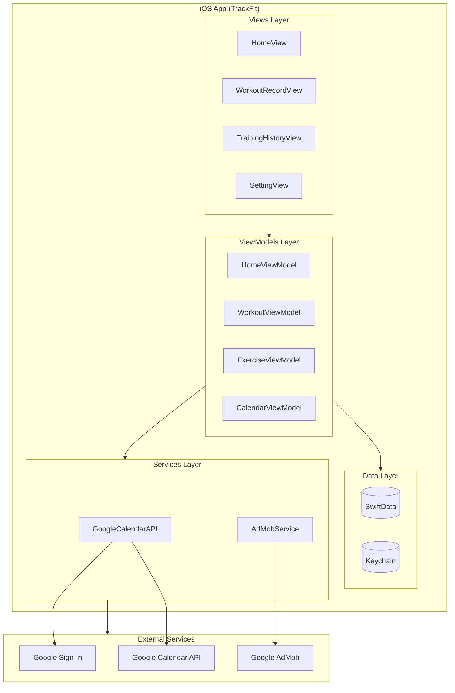
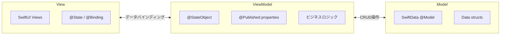

# システムアーキテクチャ

TrackFitアプリのシステム構成とアーキテクチャについて説明します。

## システム構成図

## MVVMアーキテクチャ

TrackFitはMVVM（Model-View-ViewModel）パターンを採用しています。

### 各レイヤーの責務

| レイヤー | 責務 | 主なファイル |
|----------|------|---------------|
| **View** | UI表示、ユーザー操作の受付 | `HomeView.swift`, `ContentView.swift` |
| **ViewModel** | ビジネスロジック、状態管理 | `HomeViewModel.swift`, `WorkoutViewModel.swift` |
| **Model** | データ構造、永続化 | `Exercise.swift`, `DailyWorkout.swift` |
| **Services** | 外部API連携 | `GoogleCalendarAPI.swift`, `AdMobService.swift` |

## 技術スタック

| カテゴリ | 技術 |
|----------|------|
| UIフレームワーク | SwiftUI |
| データ永続化 | SwiftData |
| 認証トークン保存 | Keychain |
| 外部認証 | Google Sign-In |
| カレンダー連携 | Google Calendar API |
| 広告 | Google AdMob |
| 最低サポートOS | iOS 18.0 |
| 言語 | Swift 6.0 |

## 関連Issue

- [Issue #123: システム構成図の作成](https://github.com/garyuu09/track-fit/issues/123)
