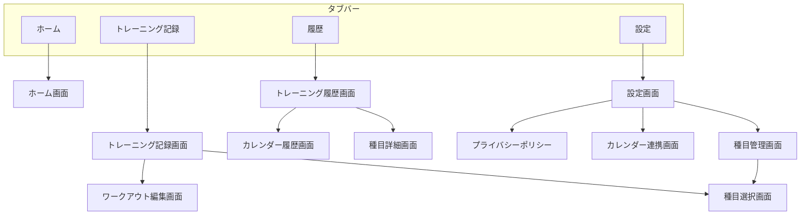

# 画面遷移図

TrackFitアプリの画面遷移を示します。

## メイン画面遷移

## タブ構成

| タブ | アイコン | メインView | 説明 |
|------|---------|----------|------|
| ホーム | `house` | HomeView | 統計情報、ヒートマップ表示 |
| トレーニング記録 | `timer` | WorkoutRecordView | ワークアウトの新規記録 |
| 履歴 | `magnifyingglass` | TrainingHistoryView | 過去の記録一覧 |
| 設定 | `gearshape` | SettingView | アプリ設定 |

## 関連Issue

- [Issue #124: 画面設計書の作成](https://github.com/garyuu09/track-fit/issues/124)
