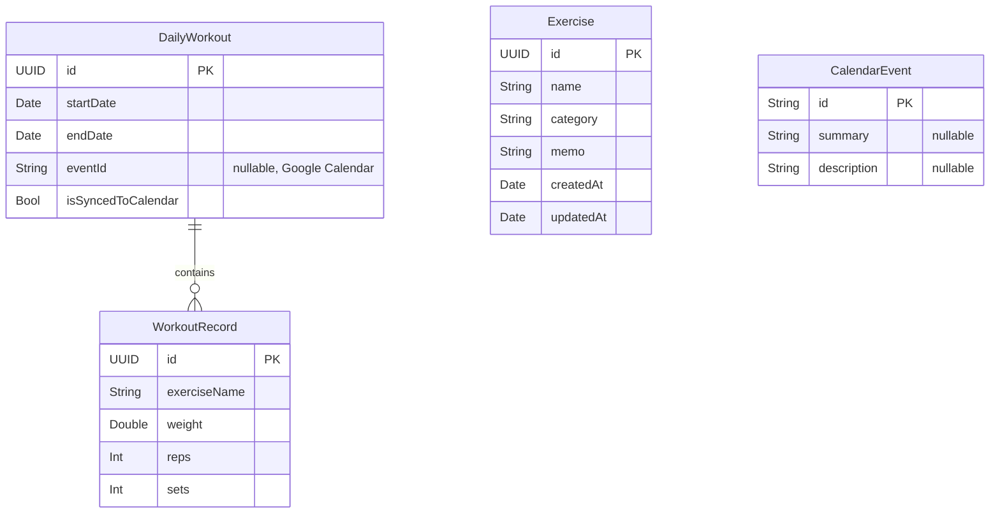

# データモデル設計書

TrackFitアプリで使用するSwiftDataモデルの定義を説明します。

## ER図

---

## Exercise（トレーニング種目）

トレーニング種目のマスタデータ。

| 論理名 | 物理名 | 型 | 必須 | 備考 |
|--------|--------|-----|:----:|------|
| ID | `id` | UUID | ○ | プライマリキー |
| 種目名 | `name` | String | ○ | |
| カテゴリ | `category` | String | ○ | 例: 胸, 背中, 足 |
| メモ | `memo` | String | | デフォルト: 空文字 |
| 作成日時 | `createdAt` | Date | ○ | 自動設定 |
| 更新日時 | `updatedAt` | Date | ○ | 更新時に自動更新 |

---

## DailyWorkout（1日分のトレーニング記録）

1日分のトレーニングセッションを表す。複数のWorkoutRecordを含む。

| 論理名 | 物理名 | 型 | 必須 | 備考 |
|--------|--------|-----|:----:|------|
| ID | `id` | UUID | ○ | プライマリキー |
| 開始日時 | `startDate` | Date | ○ | |
| 終了日時 | `endDate` | Date | ○ | |
| イベントID | `eventId` | String? | | Google CalendarイベントID |
| トレーニング記録 | `records` | [WorkoutRecord] | ○ | 1対多のリレーション |
| カレンダー連携済み | `isSyncedToCalendar` | Bool | ○ | デフォルト: false |

---

## WorkoutRecord（個別のトレーニング記録）

1つの種目に対するトレーニング記録。DailyWorkoutに属する。

| 論理名 | 物理名 | 型 | 必須 | 備考 |
|--------|--------|-----|:----:|------|
| ID | `id` | UUID | ○ | プライマリキー |
| 種目名 | `exerciseName` | String | ○ | |
| 重量 | `weight` | Double | ○ | 単位: kg |
| 回数 | `reps` | Int | ○ | 1セットあたりの回数 |
| セット数 | `sets` | Int | ○ | |

---

## CalendarEvent（カレンダーイベント）

Google Calendar APIから取得したイベント情報。

> **Note**: これはSwiftDataモデルではなく、APIレスポンス用の構造体です。

| 論理名 | 物理名 | 型 | 必須 | 備考 |
|--------|--------|-----|:----:|------|
| ID | `id` | String | ○ | Google CalendarのID |
| タイトル | `summary` | String? | | イベント名 |
| 開始 | `start` | EventDateTime? | | |
| 終了 | `end` | EventDateTime? | | |
| 説明 | `description` | String? | | トレーニング内容 |

## 関連Issue

- [Issue #125: SwiftDataモデル設計書の作成](https://github.com/garyuu09/track-fit/issues/125)
