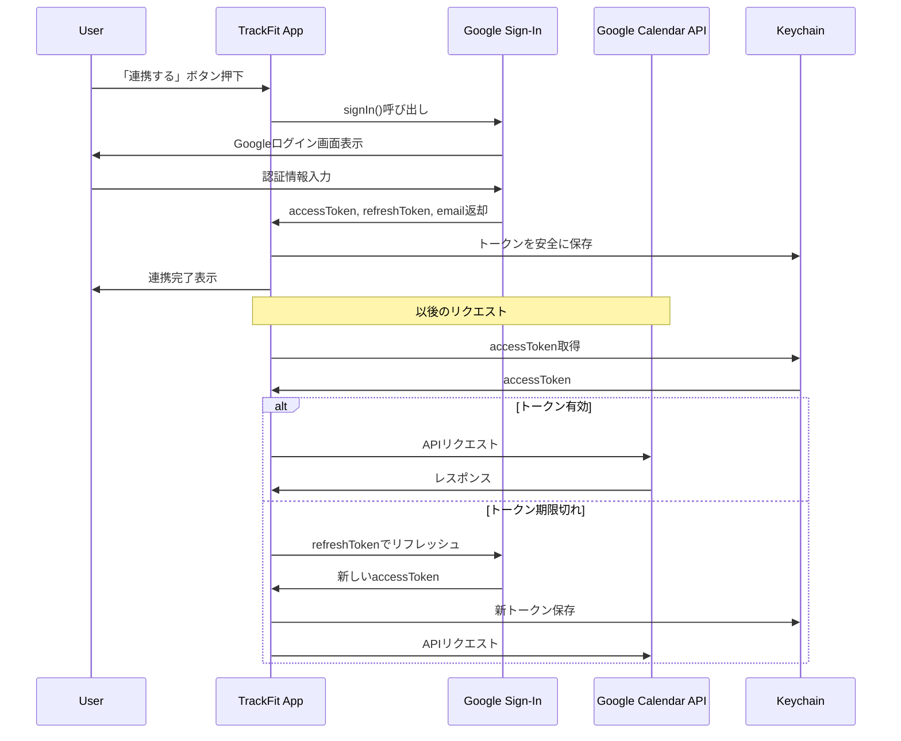

# Google Calendar API連携設計書

TrackFitアプリのGoogle Calendar API連携について説明します。

## 認証フロー

## トークン管理

### 保存先

Keychainを使用して安全に保存。

| キー | 内容 |
|-----|------|
| `accessToken` | APIアクセストークン |
| `refreshToken` | トークンリフレッシュ用 |
| `idToken` | ユーザー識別用 |
| `email` | 連携アカウントのメールアドレス |
| `expiryDate` | トークン有効期限 |

---

## API一覧

### イベント取得

| 項目 | 値 |
|------|-----|
| Endpoint | `GET /calendar/v3/calendars/primary/events` |
| 用途 | カレンダーのイベント一覧を取得 |
| レスポンス | `[CalendarEvent]` |

### イベント作成

| 項目 | 値 |
|------|-----|
| Endpoint | `POST /calendar/v3/calendars/primary/events` |
| 用途 | トレーニング記録をカレンダーに登録 |
| リクエスト | summary, description, start, end, colorId |
| レスポンス | 作成されたイベントのID |

### イベント更新

| 項目 | 値 |
|------|-----|
| Endpoint | `PATCH /calendar/v3/calendars/primary/events/{eventId}` |
| 用途 | 既存のトレーニング記録を更新 |
| リクエスト | summary, description, start, end, colorId |

---

## エラーハンドリング

| ステータスコード | 原因 | 対応 |
|-----------------|------|------|
| 401 | 認証エラー（トークン無効） | トークンリフレッシュを試行、失敗時は再連携を促す |
| 403 | 権限不足 | スコープ確認、再連携を促す |
| 404 | イベントが存在しない | 新規作成にフォールバック |
| 429 | レート制限 | リトライ（指数バックオフ） |
| 500+ | サーバーエラー | リトライ |

---

## スコープ

以下のOAuthスコープを要求:

- `https://www.googleapis.com/auth/calendar.events`

## 関連Issue

- [Issue #126: Google Calendar API連携設計書の作成](https://github.com/garyuu09/track-fit/issues/126)
